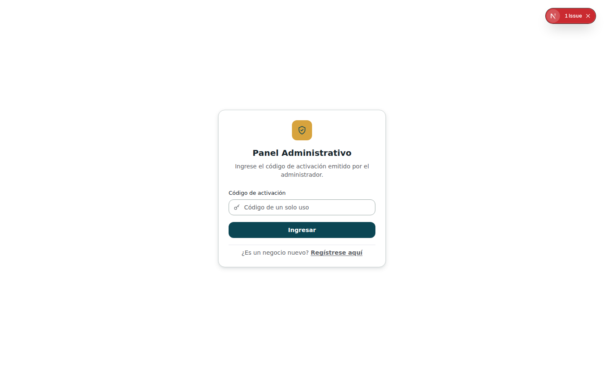
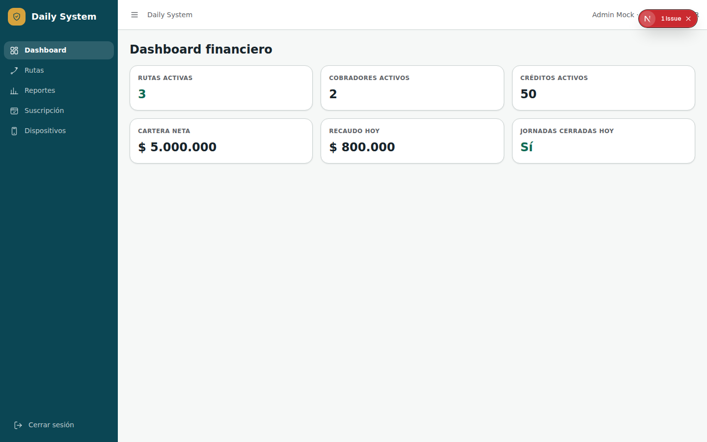
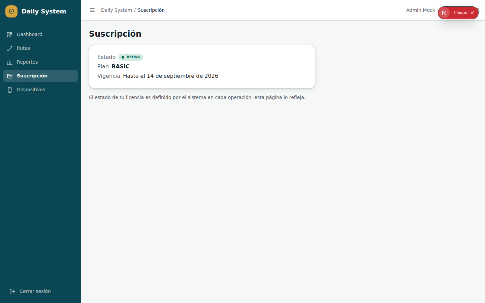
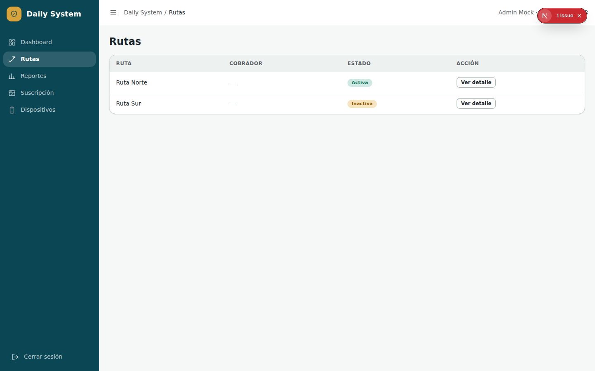
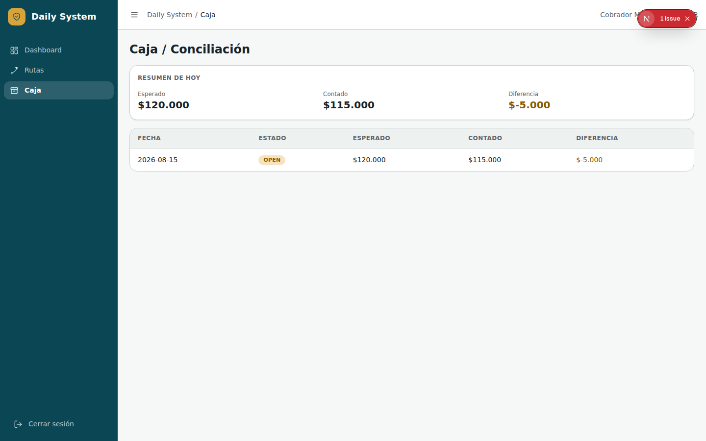
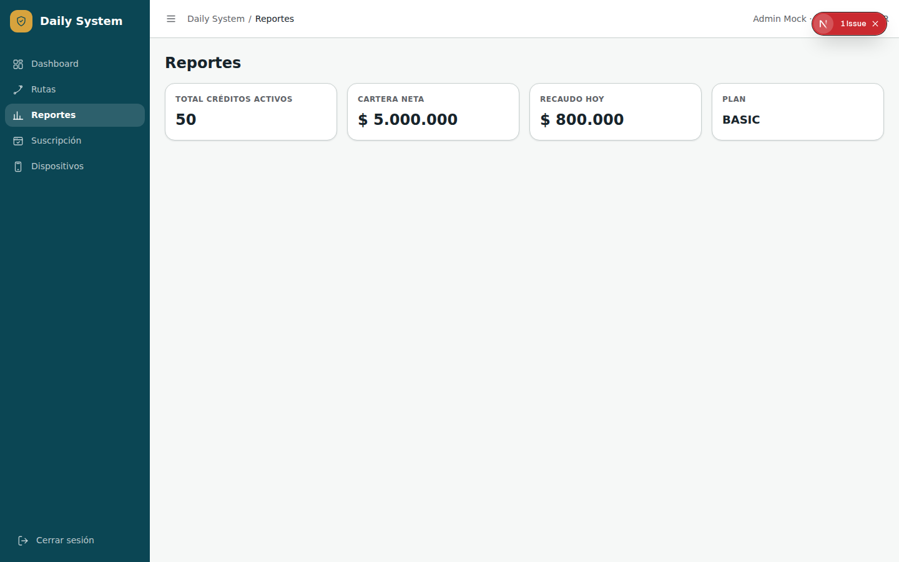
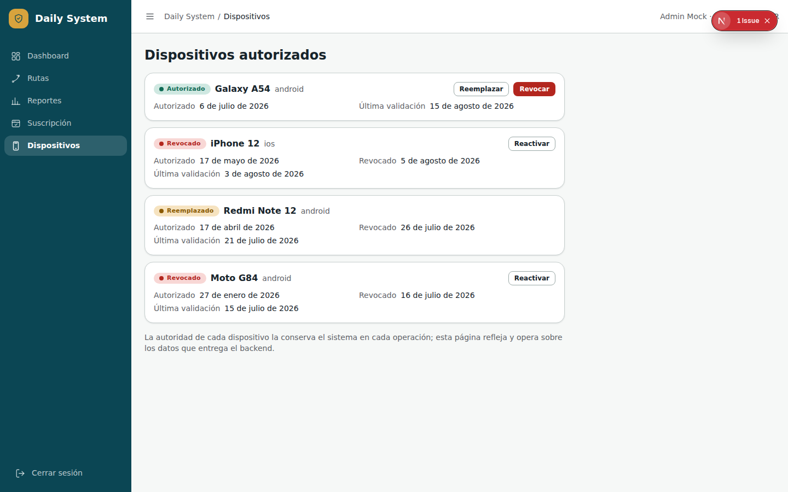
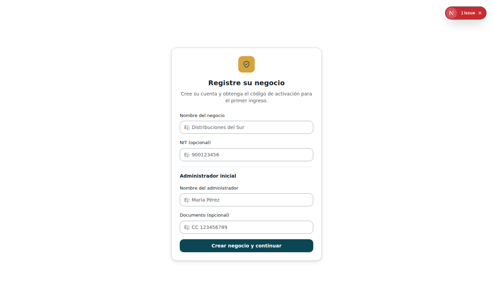

# Daily System

**Cobro diario offline — Tu ruta, tus cobros y tu caja, incluso sin internet.**


---

## Estado

**Production-grade en desarrollo — Móvil offline + Panel web administrativo.**
| Componente | Estado |
|---|---|
| Backend API (FastAPI) | ✅ Implementado — CI PASS |
| Android Offline Alpha | ✅ Implementado / APK debug construido |
| **Panel web administrativo** | ✅ **Production-grade / preparada para producción** (Next.js 16, `apps/web/`) — NO desplegada |
| Web — onboarding, dispositivos, suscripción, dashboard, rutas, caja, reportes | ✅ Implementado |
| Prototipo web visual (MOCK) | Histórico — `design/prototypes/web/` (no productivo) |
| Auth productivo (JWT ES256 + AndroidKeyStore) | ✅ Implementado |
| Bootstrap single-route | ✅ Implementado |
| Mobile auth bridge | ✅ Implementado |
| Offline sync (S0-S5) | ✅ PASS (session, ruta, pull, outbox, reasignación, conflictos) |
| Splash nativo (Android 12+) | ✅ Implementado |
| Icono adaptable (adaptive) | ✅ Implementado |
| Tema claro/oscuro | ✅ Implementado |
| Diseño tokens (JSON → Dart + CSS) | ✅ Implementado |
| Backend CI | ✅ PASS (`backend-ci.yml`) |
| Web CI | ✅ PASS (`web-ci.yml` — static + e2e mock + e2e real) |
| UI Gate CI | ✅ PASS (`ui-gate.yml` — flutter analyze + flutter test, trigger: master) |
| APK debug construido | ✅ PASS |
| Verificado en emulador (API 35) | ✅ PASS |
| Verificado en dispositivo físico | ⏳ PENDING |
| Producción / deploy | ⏳ PENDIENTE — NO desplegada todavía |

> **Rama de trabajo:** `product/web-premium-v1`
> **HEAD documental:** `33b1342` (reconciliación docs + evidencia)
> **Baseline funcional certificado:** `bbb3e102`
> `master` (`486d08b`) es una rama legacy sin el hardening. Ver [Estado del proyecto](docs/STATUS.md) para detalle en vivo.

---

## Capturas

Capturas reales del emulador Android (phone 412×915, light y dark) y del panel web production-grade.
El conjunto completo de evidencia (antes/después + manifest SHA-256) está en
[docs/ui-audit/screenshots/](docs/ui-audit/screenshots/). Las capturas web se generan con
`scripts/web/capture_web_evidence.sh` y su manifest SHA-256 vive en
[docs/assets/readme/web/desktop/](docs/assets/readme/web/desktop/manifest.json) (desktop) y
[docs/assets/readme/web/mobile/](docs/assets/readme/web/mobile/) (responsive).

### Android (claro)

| Login | Inicio | Hoja viva |
|---|---|---|
|  |  |  |

| Pago | Movimientos | Caja |
|---|---|---|
|  |  |  |

| Cierre | Historial |
|---|---|
|  |  |

### Android (oscuro)

| Login | Inicio | Cierre |
|---|---|---|
|  |  |  |

### Web — Panel administrativo (desktop 1440×900)

| Login | Dashboard | Suscripción |
|---|---|---|
|  |  |  |

| Rutas | Caja | Reportes |
|---|---|---|
|  |  |  |

| Dispositivos | Registro (onboarding) |
|---|---|
|  |  |

---

## Funciones implementadas

### Auth y seguridad del dispositivo
- Auth productivo: JWT ES256 con device/user/business/version binding
- AndroidKeyStore EC P-256 no exportable (SHA256withECDSA)
- Challenge-response single-use (daily-v1 para activación; daily-auth-v1 para auth)
- Bootstrap: credencial_bootstrap temporal → desafío/auth → access JWT → GET /api/mobile/bootstrap → sesión persistente (envelope atómico daily_session)
- Android permissions y `MethodChannel daily_system/device_identity` en `MainActivity.kt`
- Una única ruta activa derivada por servidor (el cliente no elige ruta)

### Negocio y cobro
- Gestión de negocios, rutas y clientes
- Crédito con cálculo de cuota, mora y recargo
- Hoja viva del día con estados de pago
- Registro de pagos parciales y reversiones
- Jornada de caja: apertura, movimientos, cierre
- Snapshot de jornada con hash reproducible (canonical JSON)
- Generación de PDF de cierre de jornada
- Idempotencia financiera (clave_idempotencia, full-payload comparison, 409 on mismatch)
- Suscripciones por plan (free 1 ruta/100 clientes, básico 5/500, pro ilimitado)
- Límite de rutas y clientes por plan
- Invariante de NIT por negocio garantizada por la base de datos (`m8_negocio_nit`)

### Offline sync (S0-S5)
- **S0**: session maintenance (renovación antes de expirar) — ✅ PASS
- **S1**: aislamiento de ruta (scope derivado por servidor; cliente no elige ruta) — ✅ PASS
- **S2**: pull servidor→móvil (GET /api/mobile/sync) + persistencia SQLite (UPSERT por PK, ON CONFLICT) — ✅ PASS
- **S3**: outbox móvil→servidor, push, ACK, retry y resolución de conflictos — ✅ PASS
- **S4**: reasignación de ruta R1→R2 (ruta_id_origen inmutable) + orquestación de sync — ✅ PASS
- **S5**: `conflict_service.py` — verificadores server-authoritative de conflicto (pago, movimiento, jornada, apertura, reversal, ruta) — ✅ PASS

### Panel web administrativo (`apps/web/`)
- Next.js 16 + React 19 + TypeScript + Tailwind CSS (fuente: [docs/ARCHITECTURE.md](docs/ARCHITECTURE.md))
- Login con sesión httpOnly (`daily_admin_token`) consultando `/api/auth/me` del backend (única fuente de identidad)
- RBAC por capacidades: roles `COBRADOR`, `INVERSIONISTA`, `ADMINISTRADOR` (server-side)
- Dashboard financiero, rutas, caja, reportes, dispositivos, suscripción y onboarding (registro de negocio)
- BFF con route handlers (`src/app/api/*`) — el frontend nunca deduce el rol del JWT
- E2E Playwright: mock (con axe a11y) + real contra FastAPI+Postgres
- CLI typescript generado desde `openapi.json` (`src/lib/api/generated/`)

### UI/UX
- Flutter Offline Alpha con SQLite local
- Material 3 Expressive rediseño visual
- Sistema de diseño compartido (tokens JSON → Dart + CSS)
- Tema claro/oscuro con marca consistente
- Splash nativo Android 12+ (SplashScreen API)
- Icono adaptable con monochrome
- DAILY_DEMO flag para builds de producción
- Dark mode: estructura CSS lista (`.dark` clase definida) — no habilitada (solo tema claro activo)

---

## Arquitectura

```
daily-system/
├── apps/
│   ├── mobile/          # Flutter app (Android) — cobrador offline-first
│   │   ├── lib/
│   │   │   ├── main.dart              # DAILY_DEMO, Theme.of(context)
│   │   │   ├── database/   # SQLite v2..v7, migraciones, seed
│   │   │   ├── domain/     # Tipos financieros, excepciones (JornadaGuard, etc.)
│   │   │   ├── models/     # DTOs y modelos (JornadaSnapshot, CajaResultado)
│   │   │   ├── navigation.dart  # MainShell → Inicio/Cobros/Historial/Más
│   │   │   ├── config.dart      # Flags, URLs
│   │   │   ├── auth/       # AuthHttpClient, DeviceAuthClient, DeviceIdentity, JCS, models
│   │   │   ├── sync/       # SyncClient (GET /api/mobile/sync), SyncRepository (UPSERT PK), SyncModels
│   │   │   ├── services/   # Caja, pago, hoja_viva, jornada, movimiento, sync_queue, pdf
│   │   │   ├── shell/      # MainShell, CobrosShell
│   │   │   ├── screens/    # 13 pantallas (login, inicio, cobros, pago, caja, cierre, etc.)
│   │   │   ├── theme/      # Tokens, tema, generador
│   │   │   ├── ui/         # Componentes Daily*
│   │   │   ├── widgets/
│   │   │   └── utils/
│   │   ├── android/app/         # Manifest, themes, AndroidManifest.xml (permissions)
│   │   ├── android/app/src/main/kt  # MainActivity.kt (MethodChannel device_identity)
│   │   ├── test/                # unit/widget/golden/semantics/paridad/sync (177)
│   │   ├── integration_test/    # jornada_cierre_test.dart
│   │   └── build/               # APKs (gitignored)
│   ├── web/             # Panel administrativo — Next.js 16 (productivo)
│   │   ├── src/app/             # layout, page (login), dashboard, caja, dispositivos,
│   │   │   │                   #   registro (onboarding), reportes, routes, suscripcion
│   │   │   ├── api/             # BFF — route handlers (auth, dispositivos, rutas, jornadas,
│   │   │   │                   #   inversionista, activaciones, onboarding)
│   │   │   └── globals.css
│   │   ├── src/lib/             # api/client.ts, api/gateway.ts, api/generated/,
│   │   │                       #   auth/, session.ts (httpOnly cookie + /api/auth/me), rbac.ts
│   │   ├── src/components/      # LoginPage, layout del panel, etc.
│   │   ├── e2e/                 # 19 spec files (Playwright mock + real + a11y)
│   │   ├── playwright.config.ts # mock (:8100) / real (:8001)
│   │   └── next.config.mjs      # Next 16, devIndicators top-right
│   └── api/             # FastAPI backend (autoridad financiera)
│       ├── src/
│       │   ├── main.py          # FastAPI app, CORS, routers
│       │   ├── auth/            # JWT ES256, JCS, DeviceAuth, context
│       │   ├── models/          # SQLAlchemy
│       │   ├── schemas/         # Pydantic
│       │   ├── routes/          # cliente, credito, dispositivo, hoja_viva, jornada,
│       │   │                   #   movimiento, negocio, pago, ruta, activacion, auth/web
│       │   ├── services/        # calculation, hoja_viva, jornada, movimiento, payment,
│       │   │                   #   activacion, auth_service, mobile_sync, conflict_service
│       │   └── tests/           # 367 passed, 8 skipped (SQLite)
│       ├── migrations/          # Alembic: init → m2..m8_negocio_nit (head)
│       ├── alembic.ini
│       └── requirements.txt
├── design/
│   ├── brand/           # Logo, conceptos, rationale
│   ├── tokens/          # Tokens compartidos (JSON + generados)
│   └── prototypes/      # Prototipo web estático (MOCK — histórico)
├── docs/
│   ├── STATUS.md          # Estado vivo actual
│   ├── README.md          # Índice documental
│   ├── ARCHITECTURE.md    # Arquitectura vigente
│   ├── SECURITY.md        # Auth + device + tenant + ruta + idempotencia
│   ├── OFFLINE-SYNC.md    # S0-S5 contract
│   ├── TESTING.md         # Suites, gates, CI
│   ├── IMPLEMENTATION-PLAN.md
│   ├── ENGRAM-PROTOCOL.md
│   ├── web/             # Web blueprint (prototipo histórico)
│   ├── ui-audit/        # Auditoría visual before/after (Android)
│   ├── assets/          # Capturas README optimizadas (mobile + web + manifest)
│   ├── historical/      # Documentos archivados (no son verdad vigente)
│   └── decisions/
├── scripts/
│   ├── ci/              # ui_gate.sh (strict — analyze + test + tokens)
│   ├── android/         # capture_ui_evidence.sh
│   └── web/             # capture_web_evidence.sh
├── tool/
│   └── generate_design_tokens.dart
├── infra/
│   ├── docker-compose.yml    # postgres (port 7103)
│   ├── init.sql
│   └── .env.example
└── .github/workflows/   # backend-ci.yml · web-ci.yml · ui-gate.yml
```

---

## Inicio rápido

### Requisitos

- Flutter 3.44+ / Dart 3.12+ (Android SDK 35)
- Python 3.12+ (backend)
- Node.js 22+ (panel web)
- PostgreSQL 18+ (para backend productivo; tests usan SQLite por defecto)
- Docker (para PostgreSQL dev)

### Backend

```bash
cd apps/api
python -m venv .venv && source .venv/bin/activate
pip install -r requirements.txt  # dependencias Python
alembic upgrade head  # migraciones a PostgreSQL
uvicorn src.main:app --reload  # servidor desarrollo (por defecto :8000)
```

### Móvil

```bash
cd apps/mobile
flutter pub get
flutter analyze          # 14 infos preexistentes (migraciones congeladas v5/v7) / 0 nuevos
flutter test             # 177/177 passing (goldens, semantics, paridad, sync, S0-S5)
flutter run              # requiere dispositivo/emulador
flutter build apk --debug
```

### Web

```bash
cd apps/web
npm ci
npm run dev              # servidor desarrollo (dev server + API_BASE)
npm run api:check        # drift del cliente TS contra openapi.json
npm run lint && npm run typecheck
npm run build && npm start
npm test                 # Playwright E2E (mock y real según configuración)
```

---

## Pruebas y gates

> **Último baseline verificado (2026-08-15):** `product/web-premium-v1` @ `33b1342`.
> **Baseline funcional certificado:** `bbb3e102`.
> Los workflows (`backend-ci.yml`, `web-ci.yml`) corren en GitHub Actions sobre `product/web-premium-v1`.
> `ui-gate.yml` existe con trigger en `master`; no corrió sobre este push (sin cambios Mobile).

```bash
# Gate de UI (strict — no --no-fatal flags)
scripts/ci/ui_gate.sh

# Tests móviles
cd apps/mobile
flutter analyze          # 14 infos preexistentes / 0 nuevos
flutter test             # 177 passing

# Tokens (deterministic)
dart run tool/generate_design_tokens.dart --check

# Backend (SQLite default)
cd apps/api
python3 -m pytest src/tests/   # 367 passed, 8 skipped
python3 -m alembic check       # No new upgrade operations detected

# Web
cd apps/web
npm run api:check
npm run lint
npm run typecheck
npm run build
```

| Gate | Resultado | Tool |
|---|---|---|
| Flutter analyze | 14 infos preexistentes (migraciones congeladas), 0 nuevos | flutter analyzer |
| Flutter test (mobile) | 177 passing | flutter_test |
| Backend pytest (SQLite) | 367 passed, 8 skipped | pytest |
| Alembic | head = m8_negocio_nit, clean | alembic |
| Web — api:check + lint + typecheck + build | PASS | npm (web-static CI) |
| Web E2E mock (incl. a11y axe) | PASS | Playwright (`web-e2e-mock`) |
| Web E2E real (FastAPI + Postgres) | PASS | Playwright (`web-real-integration`) |
| Backend CI (pytest + alembic + NIT PG concurrency) | PASS | `.github/workflows/backend-ci.yml` |
| Web CI (3 jobs) | PASS | `.github/workflows/web-ci.yml` |
| UI Gate CI | PASS (trigger: master; no corrió en `product/web-premium-v1`) | `.github/workflows/ui-gate.yml` |

---

## Roadmap canónico

| Etapa | Descripción | Estado |
|---|---|---|
| **Etapa 1** — que funcione | Backend + mobile ejecutable | ✅ COMPLETADA |
| **Etapa 2** — que cuadre | Idempotencia, outbox, sync, S0-S5 | ✅ COMPLETADA |
| **Etapa 3** — que se venda | Web Premium, multirol, suscripción, dispositivos, onboarding, Next 16 | **EN PROGRESO** |
| **Etapa 4** — migración fácil / OCR | Importación OCR (`ocr_service.py` pendiente) | ⏳ PENDIENTE |
| **Etapa 5** — inteligencia | Score, chatbot, predicción | ⏳ PENDIENTE |

### Detalle Etapa 3 — EN PROGRESO

- [x] Web Premium (Next.js 16) — producción-grade, NO desplegada
- [x] Multirol (COBRADOR / INVERSIONISTA / ADMINISTRADOR)
- [x] Suscripción / Licencia
- [x] Dispositivos autorizados
- [x] Alta de negocios (onboarding público)
- [x] Next 16 security baseline (CI 3/3 PASS, npm audit 0 vulns)
- [ ] Experiencia / Mini App inversionista (pendiente de decisión)
- [ ] Política de exposición del onboarding (pendiente)
- [ ] Recuperación del administrador principal (pendiente)

> **Roadmap M0-M6 (legacy):** se conserva como historia en [IMPLEMENTATION-PLAN.md](docs/IMPLEMENTATION-PLAN.md).
> El roadmap vigente es el canónico arriba. OCR no es el siguiente paso automático — sigue Etapa 3.

### Otros

- [ ] Verificado en dispositivo físico
- [ ] Producción / deploy
- [ ] Bot administrativo futuro (exclusivamente administrativo; **NO bot en móvil**)

---

## Seguridad

- Auth productivo: **JWT ES256** con device/user/negocio/version_asignacion binding
- **AndroidKeyStore** EC P-256, clave privada no exportable (SHA256withECDSA)
- Challenge-response single-use (daily-auth-v1; daily-v1 para activación)
- Tenant isolation (multi-negocio, filtrado server-side)
- Route isolation (scope derivado del servidor; cliente no elige ruta)
- Idempotencia financiera (clave_idempotencia + full-payload comparison; 409 on mismatch)
- JCS (RFC 8785) canonicalización byte-exacta en auth y activación
- SQLite local con migraciones versionadas (v2..v7)
- Hash reproducible SHA-256 de snapshot de jornada (canonical JSON)
- Backend FastAPI con auth JWT (no sesión)
- Web: sesión httpOnly (`daily_admin_token`), identidad solo vía `/api/auth/me`, RBAC por capacidades server-side
- Suscripciones y límites por plan
- Invariante de NIT en base de datos (`m8_negocio_nit`) — concurrencia 201/409 probada en CI

Ver [Security](docs/SECURITY.md), [Offline Sync](docs/OFFLINE-SYNC.md), [Architecture](docs/ARCHITECTURE.md).

---

## Documentación

| Documento | Tipo | Propósito |
|---|---|---|
| [STATUS.md](docs/STATUS.md) | **Estado vivo** | Estado productivo actual (verdad primaria) |
| [README.md](docs/README.md) | Índice | Navegador documental |
| [ARCHITECTURE.md](docs/ARCHITECTURE.md) | Normativo | Arquitectura vigente |
| [SECURITY.md](docs/SECURITY.md) | Normativo | Auth, device, tenant, ruta, idempotencia |
| [OFFLINE-SYNC.md](docs/OFFLINE-SYNC.md) | Normativo | S0-S5 contract |
| [TESTING.md](docs/TESTING.md) | Estado vivo | Suites, gates, CI |
| [IMPLEMENTATION-PLAN.md](docs/IMPLEMENTATION-PLAN.md) | Estado vivo | Roadmap reconciliado |
| [ENGRAM-PROTOCOL.md](docs/ENGRAM-PROTOCOL.md) | Normativo | Memoria de agentes |
| [Documento Maestro v1.3](docs/historical/DOCUMENTO-MAESTRO-Plataforma-Cobro-Colombia-v1.3-CERRADO.md) | Histórico | Especificación cerrada |
| [Auditoría UI/UX](docs/ui-audit/) | Evidencia | Before/after premium (Android) |
| [Web Blueprint](docs/web/WEB-UI-BLUEPRINT.md) | Histórico | Prototipo web MOCK |
| [Históricos](docs/historical/) | Archivo | Documentos archivados (no son verdad vigente) |

> 📌 **Verdad documental vigente:** `docs/STATUS.md` + `DAILY-SYSTEM-CONTEXT-HANDOFF.md`.
> El handoff operativo vigente es `DAILY-SYSTEM-CONTEXT-HANDOFF.md` (HEAD documental `33b1342`, baseline funcional `bbb3e102`).

---

## Licencia

Código con derechos reservados. No se concede licencia de uso,
copia o distribución fuera de los acuerdos autorizados.
