# Daily System

**Cobro diario offline — Tu ruta, tus cobros y tu caja, incluso sin internet.**


---

## Estado

**Alpha — APK Debug Construido**

| Componente | Estado |
|---|---|
| Backend API | Implementado |
| Android Offline Alpha | Implementado / APK debug construido |
| Panel web productivo | Planificado |
| Prototipo web visual | Implementado |
| Splash nativo (Android 12+) | ✅ Implementado |
| Icono adaptable (adaptive) | ✅ Implementado |
| Tema claro/oscuro | ✅ Implementado |
| Diseño tokens (JSON → Dart + CSS) | ✅ Implementado |
| UI Gate CI | ✅ Estricto (flutter analyze + flutter test) |
| APK de prueba física | ✅ Debug construido |
| Pantallas reales refactorizadas | ✅ Implementado (Theme.of en todas) |
| Pruebas golden y semantics | ✅ Implementado (31 goldens + 37 semantics/widgets) |
| Producción | Pendiente |

---

## Capturas

Capturas reales del emulador Android (phone 412×915, light y dark) y del prototipo web.
Generadas por `scripts/android/capture_ui_evidence.sh`; el conjunto completo before/after
está en [docs/ui-audit/screenshots/](docs/ui-audit/screenshots/) con manifest SHA-256.

### Android (claro)

| Login | Inicio | Hoja viva |
|---|---|---|
| 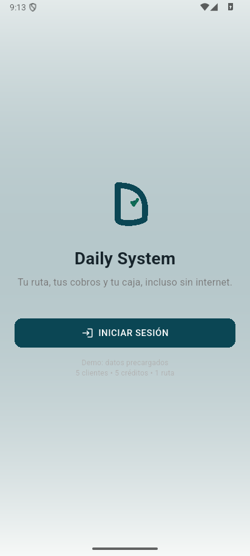 |  | 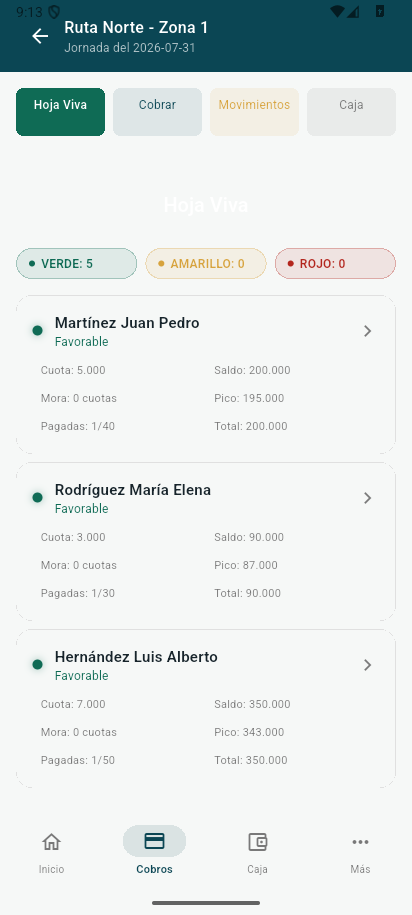 |

| Pago | Movimientos | Caja |
|---|---|---|
| 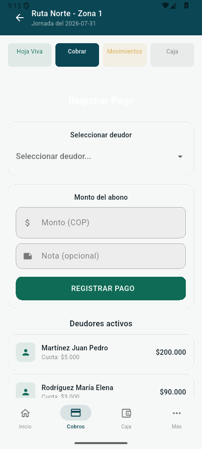 | 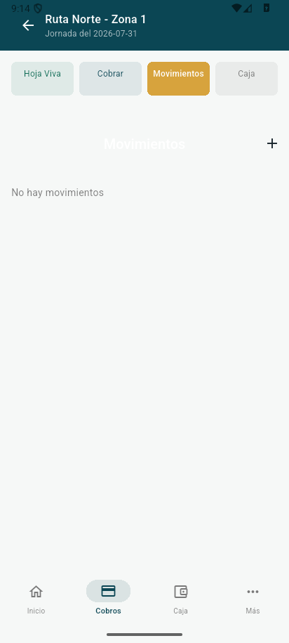 | 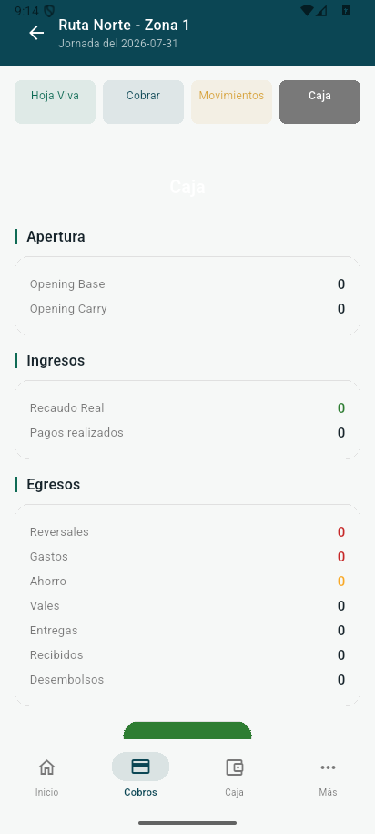 |

| Cierre | Historial | Shell principal |
|---|---|---|
| 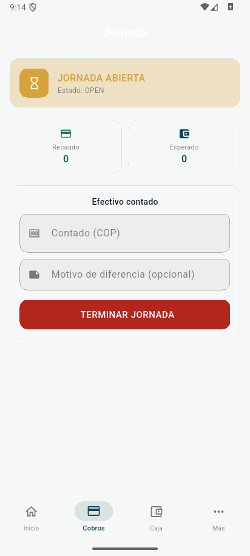 | 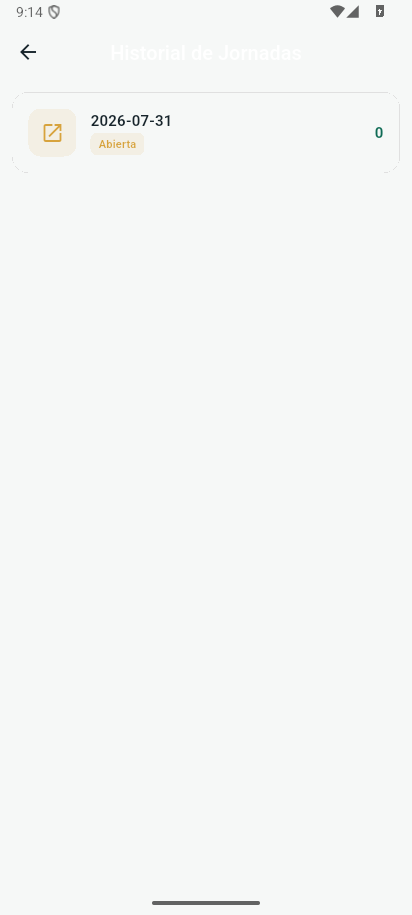 | 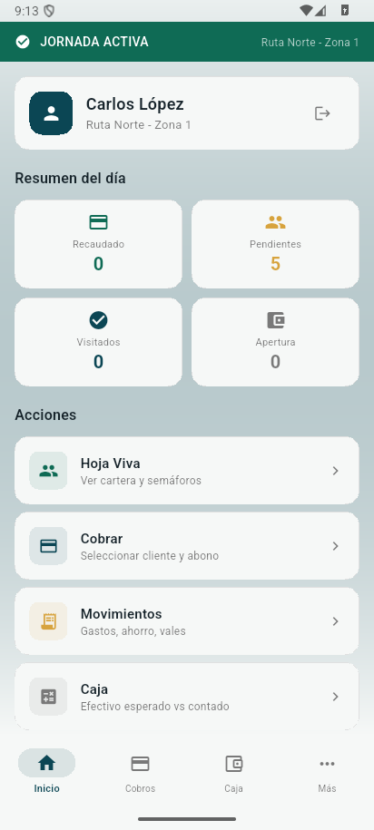 |

### Android (oscuro)

| Login | Inicio | Cierre |
|---|---|---|
| 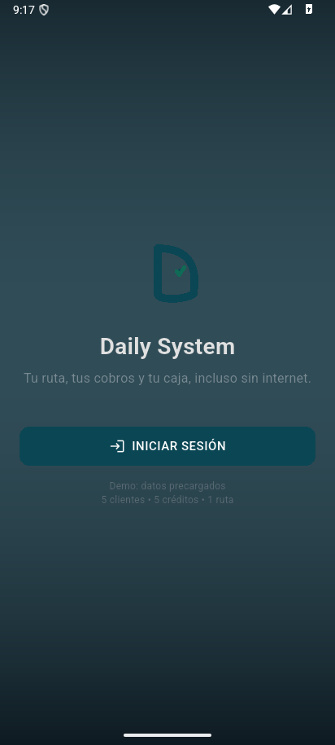 | 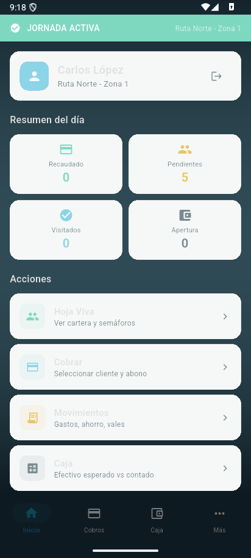 | 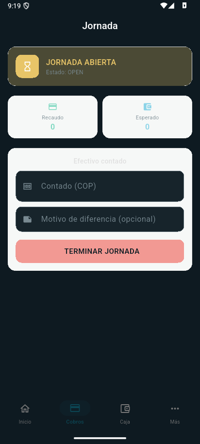 |

### Web

| Inicio | Cartera | Caja | Reportes |
|---|---|---|---|
| 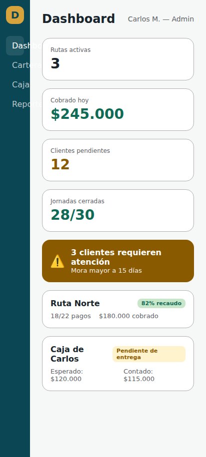 | 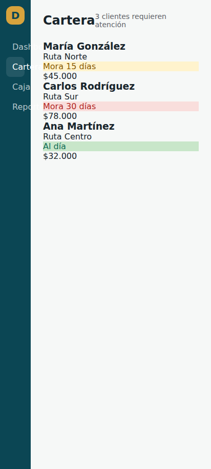 | 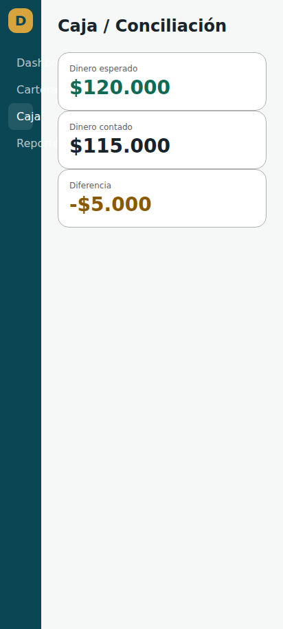 | 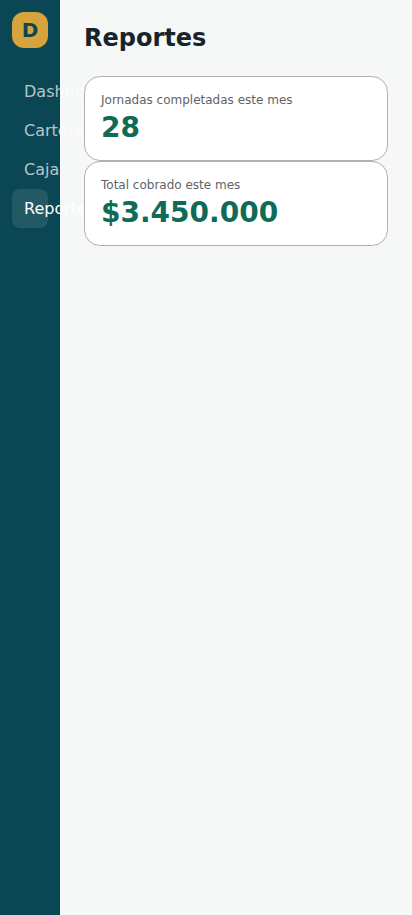 |

Prototipo visual en [design/prototypes/web/](design/prototypes/web/).

---

## Funciones implementadas

- Autenticación de cobrador con sesión persistente
- Gestión de negocios, rutas y clientes
- Crédito con cálculo de cuota, mora y recargo
- Hoja viva del día con estados de pago
- Registro de pagos parciales y reversiones
- Jornada de caja: apertura, movimientos, cierre
- Snapshot de jornada con hash reproducible
- Generación de PDF de cierre de jornada
- Sincronización colas con backend FastAPI
- Suscripciones por plan (free, básico, pro)
- Límite de rutas y clientes por plan
- Flutter Offline Alpha con SQLite local
- Material 3 Expressive rediseño visual
- Sistema de diseño compartido (tokens JSON → Dart + CSS)
- Tema claro/oscuro con marca consistente
- Splash nativo Android 12+ (SplashScreen API)
- Icono adaptable con monochrome
- DAILY_DEMO flag para builds de producción

---

## Arquitectura

```
daily-system/
├── apps/
│   ├── mobile/          # Flutter app (Android)
│   │   ├── lib/
│   │   │   ├── main.dart           # DAILY_DEMO, Theme.of(context)
│   │   │   ├── database/    # SQLite, migraciones, seed
│   │   │   ├── domain/      # Tipos financieros, excepciones
│   │   │   ├── models/      # DTOs y modelos
│   │   │   ├── routes/      # Rutas de navegación
│   │   │   ├── screens/     # Pantallas de la app
│   │   │   ├── services/    # Caja, pago, hoja viva, etc.
│   │   │   ├── shell/       # Shell principal
│   │   │   ├── theme/       # Tokens, tema, generador
│   │   │   └── ui/          # Componentes Daily*
│   │   ├── android/app/     # Android manifest, themes, icons
│   │   └── test/
│   └── api/             # FastAPI backend
│       ├── src/
│       ├── migrations/  # Alembic migrations
│       └── tests/
├── design/
│   ├── brand/           # Logo, conceptos, rationale
│   ├── tokens/          # Tokens compartidos (JSON + generados)
│   └── prototypes/      # Prototipo web estático
├── docs/
│   ├── ui-audit/        # Auditoría visual before/after
│   ├── web/             # Web UI blueprint
│   ├── assets/          # Capturas README optimizadas
│   └── DOCUMENTO-MAESTRO-Plataforma-Cobro-Colombia-v1.3-CERRADO.md
├── scripts/
│   ├── ci/              # ui_gate.sh (strict)
│   └── android/         # capture_ui_evidence.sh
├── tool/
│   └── generate_design_tokens.dart
└── graphify-out/
```

---

## Inicio rápido

### Requisitos

- Flutter 3.44+
- Dart 3.12+
- PostgreSQL 18+ (para backend)

### Backend

```bash
cd apps/api
python -m venv .venv && source .venv/bin/activate
pip install -r requirements.txt  # dependencias Python
alembic upgrade head  # migraciones a PostgreSQL
uvicorn src.main:app --reload  # servidor desarrollo
```

### Móvil

```bash
cd apps/mobile
flutter pub get
flutter analyze          # No issues found!
flutter test             # 68/68 passing
flutter run              # requiere dispositivo/emulador
flutter build apk --debug  # genera build/app/outputs/flutter-apk/app-debug.apk
```

---

## Pruebas y gates

```bash
# Gate de UI (strict — no --no-fatal flags)
scripts/ci/ui_gate.sh

# Tests móviles
cd apps/mobile
flutter analyze
flutter test

# Tokens
dart run tool/generate_design_tokens.dart --check

# Backend
cd apps/api
pytest src/tests/
alembic check
```

---

## Roadmap

- [x] M0: Fundación ejecutable
- [x] M1: Hoja viva y pagos
- [x] M2: Jornada, caja y Terminar Jornada
- [x] M3: Suscripción, Telegram, inversionista
- [x] M3.6: Flutter Offline Alpha + Visual Alpha Premium
- [x] UX/UI Premium: marca, tokens, componentes, tema
- [x] UX/UI Phase 2: splash nativo, DAILY_DEMO, light/dark, CSS generator, gate estricto
- [x] Splash nativo Android 12+ (SplashScreen API)
- [x] Icono adaptable con monochrome
- [x] Pantallas reales refactorizadas (inicio, cobros, pago, caja, cierre)
- [x] Pruebas golden y semantics
- [x] APK de prueba física (verificación en dispositivo)
- [x] Capturas profesionales before/after con manifest SHA-256
- [ ] M4: Importación OCR
- [ ] M5: Score, chatbot, inteligencia
- [ ] M6: Producción y despliegue

---

## Seguridad

- SQLite local con migraciones versionadas
- Colas de sincronización con hash de integridad
- Idempotencia en pagos y apertura de jornada
- Snapshots de jornada con SHA-256
- Backend FastAPI con autenticación por sesión
- Suscripciones y límites por plan

---

## Documentación

- [Documento Maestro v1.3](docs/DOCUMENTO-MAESTRO-Plataforma-Cobro-Colombia-v1.3-CERRADO.md)
- [Plan de Implementación](docs/IMPLEMENTATION-PLAN.md)
- [Estado del proyecto](docs/STATUS.md)
- [Blueprint Web UI](docs/web/WEB-UI-BLUEPRINT.md)
- [Auditoría UX/UI Premium](docs/ui-audit/DAILY-SYSTEM-UX-UI-PREMIUM-AUDIT.md)

---

## Licencia

Código con derechos reservados. No se concede licencia de uso,
copia o distribución fuera de los acuerdos autorizados.
